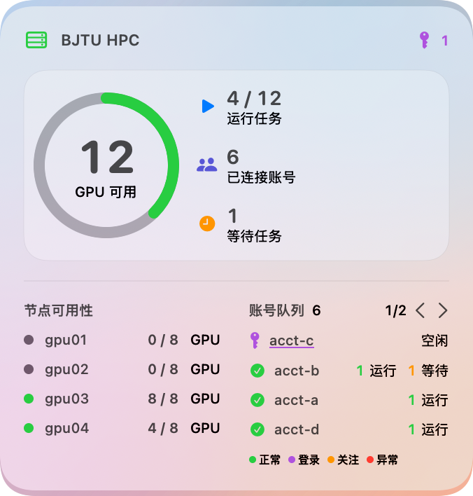
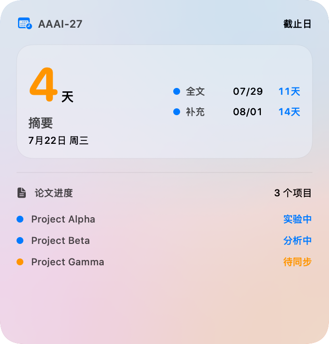
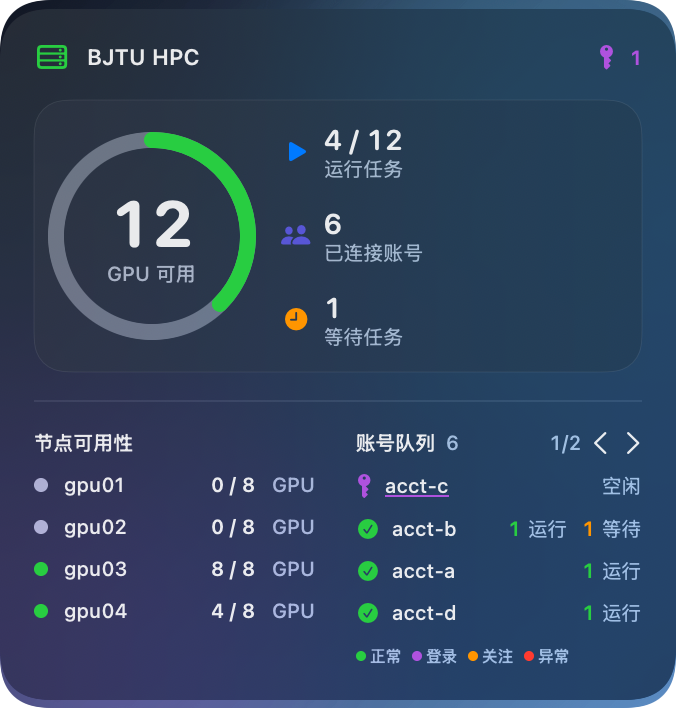
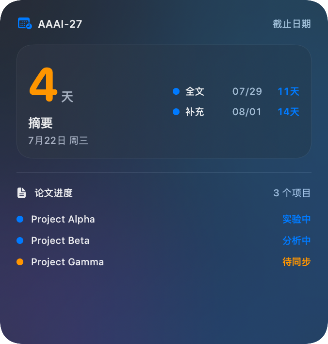
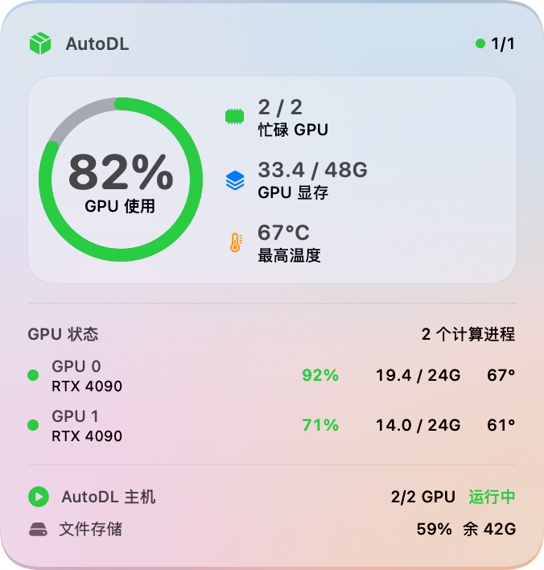
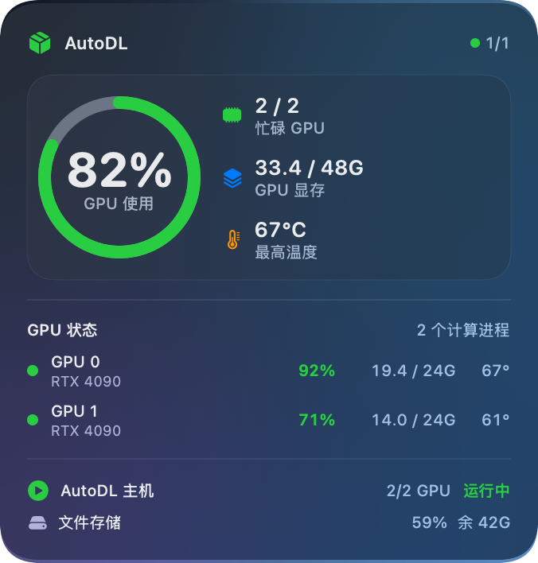

# Apple Native Widgets

Three open-source macOS WidgetKit components built with SwiftUI:

- **BJTU HPC** — redacted GPU/node availability, running-task capacity, paged account queues, account-health colors, and an optional per-account visible-login deep link.
- **AI Deadline** — upcoming conference deadlines and compact research-project status tracking.
- **AutoDL GPU** — read-only GPU utilization, memory, temperature, process, and storage monitoring over SSH.

The extensions are read-only and render local redacted JSON snapshots. The AutoDL companion monitor performs read-only SSH probes using an existing key-based SSH configuration; credentials never enter WidgetKit snapshots.

## Screenshots

The committed screenshots use synthetic account names and project data.

| BJTU HPC | AI Deadline |
| --- | --- |
|  |  |
|  |  |

| AutoDL light | AutoDL dark |
| --- | --- |
|  |  |

## Features

- Native small, medium, and large WidgetKit layouts.
- Semantic system colors, SF Symbols, dynamic light/dark appearance, and monospaced changing values.
- HPC account paging with native `AppIntent` buttons.
- Compact, single-line HPC account-state legend.
- AutoDL multi-instance monitoring with adaptive refresh intervals and redacted snapshots.
- Login links appear only when the redacted snapshot says an account needs visible authentication.
- Compatibility widget kinds preserve existing placements across upgrades.
- Synthetic preview rendering by default; real-data previews are isolated in a Git-ignored directory.

## Requirements

- macOS 14 or later
- Apple Silicon Mac
- Xcode 16 or later
- CMake with the Xcode generator

## Configure bundle identifiers

The public source uses the placeholder reverse-DNS prefix `com.example`. Replace it with a prefix you control before installing the apps. Keep the host app, extension, CMake target settings, and preview-container paths consistent.

Relevant files include:

- `HPC/AppInfo.plist`
- `HPC/ExtensionInfo.plist`
- `HPC/HPCWidget.swift`
- `Deadline/AppInfo.plist`
- `Deadline/ExtensionInfo.plist`
- `AutoDL/AppInfo.plist`
- `AutoDL/ExtensionInfo.plist`
- `AutoDL/autodl_monitor.py`
- `xcode/CMakeLists.txt`
- `render-previews.sh`

Changing bundle identifiers creates new WidgetKit containers and does not migrate existing desktop placements automatically.

## Build

```bash
./build.sh
```

Signed development products are written to:

```text
/tmp/apple-native-widgets-build/BJTU HPC Native Widget.app
/tmp/apple-native-widgets-build/AI Deadline Native Widget.app
/tmp/apple-native-widgets-build/AutoDL Native Widget.app
```

The build uses ad-hoc signing for local development. Production distribution requires your own signing identity and Apple provisioning setup.

## Render privacy-safe screenshots

```bash
./render-previews.sh
```

This command always renders synthetic data into `previews/`. To inspect local redacted snapshots without risking accidental publication:

```bash
./render-previews.sh --live
```

Live renders go to the Git-ignored `previews-live/` directory.

## Snapshot contract

Each extension reads `snapshot.json` from its sandboxed Application Support directory:

```text
BJTUHPCNativeWidget/snapshot.json
AIDeadlineNativeWidget/snapshot.json
AutoDLNativeWidget/snapshot.json
```

The Swift `Decodable` structures in `HPC/HPCWidget.swift`, `Deadline/DeadlineWidget.swift`, and `AutoDL/AutoDLWidget.swift` define the accepted schemas. Snapshot producers should:

- emit aliases instead of portal usernames or email addresses;
- omit tokens, cookies, passwords, private keys, and raw authentication responses;
- use anonymous job identifiers where job details are included;
- write atomically so WidgetKit never reads a partial JSON document.

## AutoDL monitoring

Copy the monitor into its runtime directory, then create a local configuration from the example:

```bash
mkdir -p "$HOME/Library/AutoDLNativeWidget"
cp AutoDL/autodl_monitor.py AutoDL/run_autodl_monitor.sh AutoDL/config.example.json "$HOME/Library/AutoDLNativeWidget/"
mv "$HOME/Library/AutoDLNativeWidget/config.example.json" "$HOME/Library/AutoDLNativeWidget/config.json"
chmod 700 "$HOME/Library/AutoDLNativeWidget/autodl_monitor.py" "$HOME/Library/AutoDLNativeWidget/run_autodl_monitor.sh"
chmod 600 "$HOME/Library/AutoDLNativeWidget/config.json"
```

Edit `config.json` to reference SSH aliases or targets that already support key-based authentication. The configuration deliberately rejects password, token, cookie, secret, and private-key fields. Validate and collect once with:

```bash
AutoDL/run_autodl_monitor.sh check-config --config "$HOME/Library/AutoDLNativeWidget/config.json"
AutoDL/run_autodl_monitor.sh once --config "$HOME/Library/AutoDLNativeWidget/config.json"
```

`AutoDL/com.example.autodl-native-widget-monitor.plist` is an optional LaunchAgent template for continuous adaptive refresh. Update `com.example` consistently before loading it.

## HPC interactions

The HPC host app recognizes these local URL routes:

```text
bjtu-hpc-widget://dashboard
bjtu-hpc-widget://token?account=<redacted-alias>
bjtu-hpc-widget://reload
```

The default dashboard endpoint is `http://127.0.0.1:8765/`. Adapt the host app if your local dashboard uses a different endpoint. The visible-login route is only exposed for accounts marked as needing login by the redacted snapshot.

## Privacy

No real snapshot, account alias, local user path, token, cookie, or unpublished project title is included in this repository. See [SECURITY.md](SECURITY.md) before attaching logs or screenshots to an issue.

## License

Copyright © 2026 contributors.

Licensed under the **GNU General Public License v3.0 or later** (`GPL-3.0-or-later`). Modified and redistributed versions must remain available under the same reciprocal open-source terms. See [LICENSE](LICENSE).
